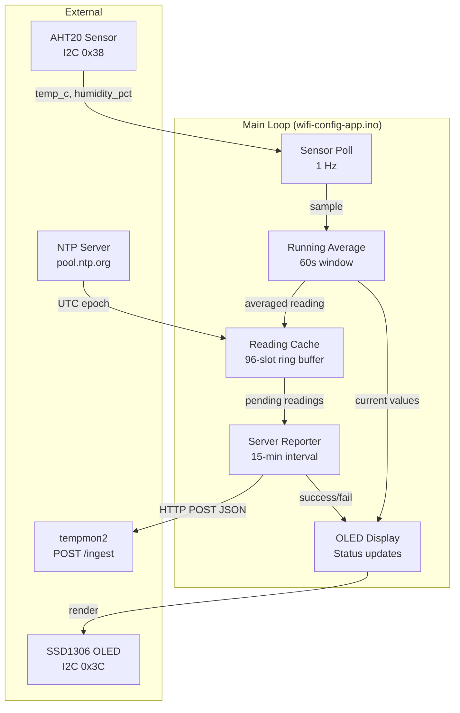

# Design Document: Hygrometer Reporting

## Overview

This design describes the periodic hygrometer reporting subsystem for the Adafruit Feather M0 WiFi device. The system reads temperature and humidity from an AHT20 sensor, maintains a 60-second running average to smooth noise, caches timestamped readings in a bounded ring buffer, and transmits batches to the tempmon2 server's `/ingest` endpoint over HTTP POST at 15-minute intervals.

The design integrates with the existing wifi-config-app architecture: the device boots into STA mode (after WiFi credentials are configured), synchronizes its clock via NTP, then enters a continuous loop of sensor polling, averaging, caching, and reporting. The OLED display provides real-time feedback on sensor values and transmission status.

### Key Design Decisions

1. **Ring buffer for reading cache** — A fixed-size circular buffer (96 slots) avoids dynamic memory allocation on the RAM-constrained SAMD21 (32 KB). Oldest readings are overwritten when full.
2. **Sliding window average** — A circular sample buffer holds up to 60 one-second samples. Expired samples are logically discarded by tracking a head/tail index with timestamps.
3. **NTP via WiFiUDP** — Uses the `WiFiUDP` class from WiFi101 with a lightweight NTP packet exchange (no full NTP library dependency). Re-syncs every 24 hours.
4. **No web server in STA mode** — The WiFiServer only runs in AP mode (for WiFi credential configuration). In STA mode, the web server is not started, so there is no conflict between WiFiServer and WiFiClient on the ATWINC1500. The HTTP POST for reporting uses WiFiClient exclusively.
5. **Module-level C functions** — Follows the existing project pattern (e.g., `healthClient_fetch()`, `wifiManager_connect()`) with `static` module state and header-exposed API functions.

## Architecture



### Execution Flow

1. **Boot** → WiFi connect (existing) → NTP sync → enter main loop
2. **Every 1 second** → Read AHT20, push sample into running average window
3. **Every 15 minutes** → Snapshot running average → store in reading cache with UTC timestamp
4. **Every 15 minutes (after caching)** → Attempt HTTP POST of all cached readings → on success, clear transmitted entries
5. **Continuously** → Update OLED with current averages and cache status

## Components and Interfaces

### 1. Sensor Poller (`sensor_poller.h` / `sensor_poller.cpp`)

Reads the AHT20 sensor at 1 Hz and feeds samples to the running average module.

```cpp
// Initialize the AHT20 sensor. Returns true if sensor detected on I2C bus.
bool sensorPoller_init();

// Read the sensor. Returns true if a valid reading was obtained.
// On success, populates temp_c and humidity_pct.
// On failure, outputs are unchanged and the sample is discarded.
bool sensorPoller_read(float& temp_c, float& humidity_pct);
```

### 2. Running Average (`running_average.h` / `running_average.cpp`)

Maintains a 60-second sliding window of temperature and humidity samples.

```cpp
// Maximum samples in the window (1 per second × 60 seconds)
#define RUNNING_AVG_WINDOW_SIZE 60

// Minimum samples required before the average is considered valid
#define RUNNING_AVG_MIN_SAMPLES 10

struct AverageSample {
    float temp_c;
    float humidity_pct;
    unsigned long timestamp_ms;  // millis() at time of capture
};

// Initialize/reset the running average state
void runningAverage_init();

// Add a new sample. Automatically expires samples older than 60 seconds.
void runningAverage_addSample(float temp_c, float humidity_pct);

// Get the current average. Returns true if at least MIN_SAMPLES exist.
// On success, populates avg_temp_c and avg_humidity_pct.
bool runningAverage_get(float& avg_temp_c, float& avg_humidity_pct);

// Get the current sample count in the window
int runningAverage_sampleCount();
```

### 3. NTP Client (`ntp_client.h` / `ntp_client.cpp`)

Synchronizes the device clock with an NTP server and provides UTC timestamps.

```cpp
#define NTP_MAX_RETRIES 5
#define NTP_RETRY_DELAY_MS 10000
#define NTP_RESYNC_INTERVAL_MS 86400000UL  // 24 hours

// Perform initial NTP synchronization. Retries up to NTP_MAX_RETRIES times.
// Returns true if sync succeeded.
bool ntpClient_sync();

// Check if NTP has been successfully synchronized at least once
bool ntpClient_isSynced();

// Check if a re-sync is needed (24 hours elapsed since last sync)
bool ntpClient_needsResync();

// Get the current UTC epoch time (seconds since 1970-01-01T00:00:00Z).
// Only valid after successful sync.
unsigned long ntpClient_getEpoch();

// Format the current UTC time as ISO 8601 string with timezone offset.
// Writes to the provided buffer (must be at least 26 bytes).
// Example output: "2024-01-15T10:30:00+00:00"
void ntpClient_formatISO8601(char* buffer, int bufferSize);
```

### 4. Reading Cache (`reading_cache.h` / `reading_cache.cpp`)

A bounded ring buffer storing timestamped readings awaiting transmission.

```cpp
#define READING_CACHE_MAX_SIZE 96

struct CachedReading {
    char timestamp[26];    // ISO 8601 UTC string (e.g., "2024-01-15T10:30:00+00:00")
    float temperature_f;   // Fahrenheit, rounded to 1 decimal
    float humidity_pct;    // Relative humidity percentage
    bool occupied;         // Slot is in use
};

// Initialize the reading cache (clear all slots)
void readingCache_init();

// Add a new reading to the cache. If full, overwrites the oldest entry.
void readingCache_add(const char* timestamp, float temperature_f, float humidity_pct);

// Get the number of readings currently in the cache
int readingCache_count();

// Get a pointer to the internal array and the count for iteration.
// The caller must not modify the array.
const CachedReading* readingCache_getAll(int& count);

// Remove the oldest N readings from the cache (after successful transmission)
void readingCache_removeOldest(int n);

// Clear all readings from the cache
void readingCache_clear();
```

### 5. Server Reporter (`server_reporter.h` / `server_reporter.cpp`)

Transmits cached readings to the tempmon2 ingest endpoint via HTTP POST.

```cpp
#define REPORT_INTERVAL_MS 900000UL  // 15 minutes
#define INGEST_HOST "tempmon.walkerweb.us"
#define INGEST_PATH "/ingest"
#define INGEST_PORT 80
#define DEVICE_LOCATION "feather-m0-01"

enum ReportResult {
    REPORT_SUCCESS,           // All readings accepted (some may be duplicates)
    REPORT_PARTIAL_SUCCESS,   // Server responded but with errors for some readings
    REPORT_CONNECTION_FAILED, // Could not connect to server
    REPORT_TIMEOUT,           // Connected but response timed out
    REPORT_PARSE_ERROR        // Response received but not valid JSON
};

// Attempt to transmit all cached readings to the server.
// Returns the result of the transmission attempt.
// On REPORT_SUCCESS, the caller should clear transmitted readings from cache.
ReportResult serverReporter_send(const CachedReading* readings, int count);

// Parse the server response to determine how many readings were accepted.
// Returns the number of readings to remove from cache (inserted + skipped duplicates).
int serverReporter_parseResponse(const char* responseBody, int totalSent);
```

### 6. Temperature Converter (inline utility)

```cpp
// Convert Celsius to Fahrenheit, rounded to 1 decimal place
float celsiusToFahrenheit(float temp_c);
```

This is a pure function suitable for inlining in a header or as a static helper:

```cpp
static inline float celsiusToFahrenheit(float temp_c) {
    float raw = (temp_c * 9.0f / 5.0f) + 32.0f;
    return roundf(raw * 10.0f) / 10.0f;  // Round to 1 decimal
}
```

### 7. OLED Display Updates (integrated into `wifi-config-app.ino`)

The existing `oledMsg()` helper is extended with new display states:

```cpp
// Show current sensor averages (called continuously in STA mode loop)
void oledShowReadings(float temp_f, float humidity_pct, int cacheCount);

// Show upload success indicator (called after successful transmission)
void oledShowUploadSuccess(int sentCount);

// Show upload failure indicator (called after failed transmission)
void oledShowUploadFailed(int cacheCount);

// Show NTP sync error
void oledShowNtpError();
```

## Data Models

### Sensor Sample (in-memory, running average window)

| Field | Type | Description |
|-------|------|-------------|
| `temp_c` | `float` | Temperature in Celsius from AHT20 |
| `humidity_pct` | `float` | Relative humidity percentage from AHT20 |
| `timestamp_ms` | `unsigned long` | `millis()` value when sample was taken |

### Cached Reading (in-memory ring buffer)

| Field | Type | Size | Description |
|-------|------|------|-------------|
| `timestamp` | `char[]` | 26 bytes | ISO 8601 UTC string |
| `temperature_f` | `float` | 4 bytes | Fahrenheit, 1 decimal precision |
| `humidity_pct` | `float` | 4 bytes | Relative humidity percentage |
| `occupied` | `bool` | 1 byte | Whether this slot contains valid data |

**Total per reading**: ~35 bytes  
**Total cache**: 96 × 35 = ~3,360 bytes (well within SAMD21's 32 KB RAM)

### HTTP POST Request Body (JSON)

```json
{
  "readings": [
    {
      "timestamp": "2024-01-15T10:30:00+00:00",
      "temperature_f": 72.5,
      "humidity_pct": 45.2,
      "location": "feather-m0-01"
    }
  ]
}
```

### HTTP Response Body (Success — 200 or 201)

```json
{
  "status": "success",
  "inserted_count": 3,
  "skipped_count": 1,
  "request_ids": ["uuid1", "uuid2", "uuid3"],
  "skipped": [
    { "index": 0, "reason": "duplicate" }
  ]
}
```

### Memory Budget

| Component | Estimated RAM |
|-----------|--------------|
| Running average buffer (60 samples × 12 bytes) | 720 bytes |
| Reading cache (96 slots × 35 bytes) | 3,360 bytes |
| HTTP response buffer | 512 bytes |
| JSON serialization buffer | 1,024 bytes |
| NTP packet buffer | 48 bytes |
| OLED frame buffer (128×32 / 8) | 512 bytes |
| **Total new allocation** | **~6,176 bytes** |
| Existing usage (WiFi stack, OLED, etc.) | ~12,000 bytes |
| **Remaining from 32 KB** | **~13,800 bytes** |


## Correctness Properties

*A property is a characteristic or behavior that should hold true across all valid executions of a system — essentially, a formal statement about what the system should do. Properties serve as the bridge between human-readable specifications and machine-verifiable correctness guarantees.*

### Property 1: Running average computes correct windowed mean

*For any* sequence of temperature and humidity samples with associated timestamps, the running average SHALL equal the arithmetic mean of only those samples whose timestamps fall within the most recent 60 seconds, and samples older than 60 seconds SHALL NOT contribute to the computed average.

**Validates: Requirements 2.1, 2.2, 2.3**

### Property 2: Minimum sample threshold gates average validity

*For any* number of samples N added to the running average window, `runningAverage_get()` SHALL return false when N < 10 and SHALL return true when N ≥ 10.

**Validates: Requirements 2.5**

### Property 3: ISO 8601 timestamp format round-trip

*For any* valid UTC epoch value (within the range 2020-01-01 to 2099-12-31), formatting the epoch as an ISO 8601 string and parsing it back SHALL produce the same epoch value, and the formatted string SHALL match the pattern `YYYY-MM-DDTHH:MM:SS+00:00`.

**Validates: Requirements 3.5**

### Property 4: Reading cache capacity invariant

*For any* sequence of `readingCache_add()` calls (regardless of length), `readingCache_count()` SHALL never exceed `READING_CACHE_MAX_SIZE` (96).

**Validates: Requirements 4.2**

### Property 5: Ring buffer preserves most recent readings in FIFO order

*For any* sequence of N readings added to the cache where N > 96, the cache SHALL contain exactly the most recent 96 readings in insertion order, and `readingCache_count()` SHALL only decrease when `readingCache_removeOldest()` is explicitly called.

**Validates: Requirements 4.3, 4.4**

### Property 6: JSON serialization contains all required fields

*For any* array of CachedReading structs with valid data, the serialized JSON output SHALL be a valid JSON object containing a "readings" array where each element has "timestamp" (string), "temperature_f" (number), "humidity_pct" (number), and "location" (string) fields with values matching the input structs.

**Validates: Requirements 5.2**

### Property 7: Response parser computes correct removal count

*For any* valid server success response containing `inserted_count` and `skipped_count` fields, `serverReporter_parseResponse()` SHALL return a value equal to `inserted_count + skipped_count`.

**Validates: Requirements 5.3, 5.5**

### Property 8: Celsius to Fahrenheit conversion with rounding

*For any* float value representing a temperature in Celsius (within the AHT20's operating range of -40°C to 85°C), `celsiusToFahrenheit()` SHALL produce a value equal to `round((temp_c × 9 / 5) + 32, 1 decimal place)`, and the result multiplied by 10 SHALL be an integer within floating-point tolerance.

**Validates: Requirements 6.1, 6.2**

## Error Handling

### Sensor Errors

| Condition | Behavior |
|-----------|----------|
| AHT20 not detected at boot | `sensorPoller_init()` returns false; OLED shows error; device does not enter polling loop |
| AHT20 read fails mid-operation | Sample discarded; running average unaffected; next poll at normal 1-second interval |
| I2C bus hang | Watchdog timer (if enabled) resets device; otherwise next read attempt after 1 second |

### NTP Errors

| Condition | Behavior |
|-----------|----------|
| Initial sync fails (all 5 retries) | OLED shows "NTP Failed"; no readings recorded; retry on next loop iteration |
| 24-hour re-sync fails | Continue using existing time offset; retry at next opportunity; log warning |
| UDP packet loss | NTP request times out after 2 seconds; counted as a failed attempt |

### Network/Server Errors

| Condition | Behavior |
|-----------|----------|
| WiFi disconnected | `wifiManager_isConnected()` returns false; skip transmission; readings remain cached |
| DNS resolution fails | Connection attempt fails; readings remain cached for next interval |
| TCP connection refused/timeout | `REPORT_CONNECTION_FAILED` or `REPORT_TIMEOUT`; readings remain cached |
| Server returns HTTP 4xx/5xx | Readings remain cached; OLED shows failure with cache count |
| Server returns malformed JSON | `REPORT_PARSE_ERROR`; readings remain cached (conservative approach) |
| Server returns `status: "error"` | Readings remain cached; treat as transmission failure |

### Memory Errors

| Condition | Behavior |
|-----------|----------|
| Cache full (96 readings) | Oldest reading evicted (ring buffer wrap); no allocation failure possible |
| JSON serialization buffer overflow | Truncate payload to fit buffer; send partial batch; remaining readings stay cached |

### Hardware Constraints

| Condition | Behavior |
|-----------|----------|
| ATWINC1500 WiFiServer/WiFiClient conflict | Not applicable in STA mode — the web server only runs in AP mode for WiFi configuration. In STA mode, only WiFiClient is used (for HTTP POST and NTP), so no conflict exists. |
| OLED I2C failure | Display calls silently fail; core functionality (sensing, caching, reporting) unaffected |

## Testing Strategy

### Property-Based Testing (RapidCheck + Catch2)

The project uses **RapidCheck** for property-based testing and **Catch2** as the test framework, consistent with the existing test suite. Tests run on the host (x86/x64) using extracted pure logic — no Arduino hardware required.

**Configuration:**
- Minimum 100 iterations per property test (RapidCheck default)
- Each test tagged with feature and property reference
- Tag format: `Feature: hygrometer-reporting, Property {N}: {title}`

**Property tests to implement:**

| Property | Module Under Test | Key Generators |
|----------|-------------------|----------------|
| 1: Running average correctness | `running_average` (pure logic extracted) | Random float sequences with timestamps |
| 2: Minimum sample threshold | `running_average` (pure logic extracted) | Random sample counts 0–60 |
| 3: ISO 8601 round-trip | `ntp_client` (format function extracted) | Random epoch values in valid range |
| 4: Cache capacity invariant | `reading_cache` (pure logic extracted) | Random add sequences of length 1–300 |
| 5: Ring buffer FIFO order | `reading_cache` (pure logic extracted) | Random reading sequences of length > 96 |
| 6: JSON serialization | `server_reporter` (serialization extracted) | Random CachedReading arrays |
| 7: Response parser | `server_reporter` (parser extracted) | Random valid JSON response strings |
| 8: Temperature conversion | `celsiusToFahrenheit` (pure function) | Random floats in [-40, 85] |

### Unit Tests (Example-Based)

| Test | What It Verifies |
|------|-----------------|
| Sensor read success/failure | `sensorPoller_read()` returns correct values or false on I2C error |
| NTP retry logic | Exactly 5 retries with 10-second delays on failure |
| NTP re-sync timing | `needsResync()` returns true after 24 hours |
| Cache add/remove basic flow | Add 3 readings, remove 2, verify 1 remains |
| Server reporter HTTP formatting | Correct HTTP headers (Host, Content-Type, Content-Length) |
| OLED display states | Correct strings rendered for each display state |

### Integration Tests

| Test | What It Verifies |
|------|-----------------|
| Full reporting cycle (mocked server) | Sensor → average → cache → serialize → POST → parse response → clear cache |
| NTP sync with mock UDP | Correct NTP packet format sent; epoch extracted from response |
| WiFi disconnect recovery | Readings cached during disconnect; transmitted after reconnect |

### Test Architecture

Pure logic is extracted into testable header files (following the existing pattern in `test/health_parser.h`, `test/url_decode.h`):

- `test/running_average_logic.h` — arithmetic mean and window expiration logic
- `test/reading_cache_logic.h` — ring buffer add/remove/count logic
- `test/temperature_convert.h` — `celsiusToFahrenheit()` pure function
- `test/ntp_format.h` — ISO 8601 formatting logic
- `test/json_serializer.h` — reading-to-JSON serialization
- `test/response_parser.h` — server response JSON parsing

Mock headers in `test/mocks/` provide stubs for Arduino-specific APIs (`millis()`, `WiFiClient`, `WiFiUDP`, `Adafruit_AHTX0`, `Adafruit_SSD1306`).
