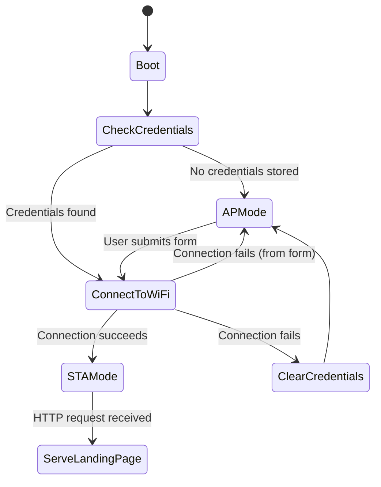
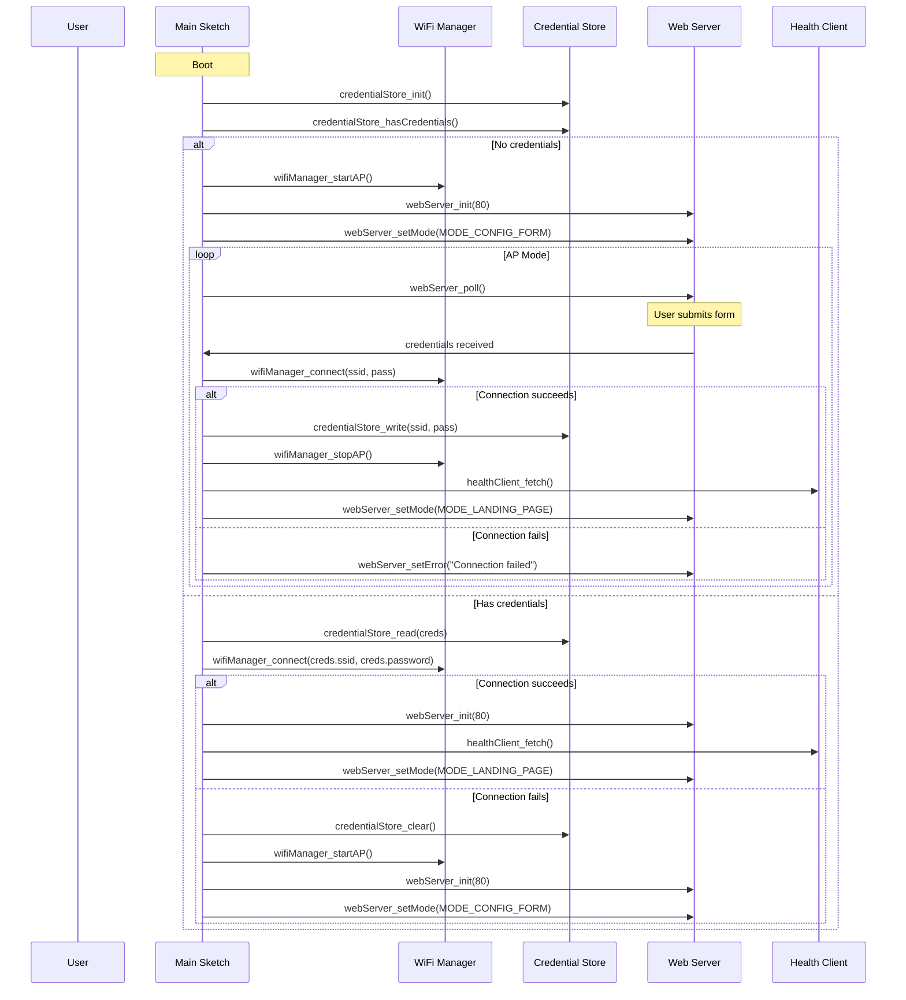

# Design Document

## Overview

This design describes a WiFi configuration application for the Adafruit Feather M0 (SAMD21) microcontroller. The device operates in two modes:

1. **Access Point (AP) mode** — When no WiFi credentials are stored, the device creates an open access point named "tempmon" and serves a web form for credential entry.
2. **Station (STA) mode** — When valid credentials are stored and connection succeeds, the device connects to the user's WiFi network and serves a landing page displaying health information from a remote server.

The application is built as an Arduino sketch using the WiFi101 library (for the ATWINC1500 radio on the Feather M0), FlashStorage for credential persistence on the SAMD21, and ArduinoJson for parsing the remote health endpoint response.

## Architecture

The system follows a state-machine architecture with two primary states and transitions driven by credential availability and connection outcomes.



### Key Design Decisions

1. **WiFi101 library** — The Feather M0 uses the ATWINC1500 WiFi module, which is supported by the WiFi101 library. This library provides `WiFi.beginAP()` for AP mode and `WiFi.begin(ssid, pass)` for station mode, plus `WiFiServer` and `WiFiClient` for HTTP serving and outbound requests.

2. **FlashStorage library** — The SAMD21 has no true EEPROM. The `FlashStorage` library (by cmaglie) emulates EEPROM using a dedicated flash page. It supports reading/writing arbitrary structs. Credentials are stored as a fixed-size struct with a validity flag.

3. **ArduinoJson** — The most widely-used and actively maintained JSON library for Arduino. It handles parsing the health endpoint's JSON response (`{"status":"ok","version":"X.Y.Z"}`) with minimal memory overhead using a static `JsonDocument`.

4. **No HTTPS** — The health endpoint uses plain HTTP. The WiFi101 library supports TLS via `WiFiSSLClient`, but the target endpoint is HTTP-only, so we use `WiFiClient` directly.

5. **Single-threaded cooperative model** — Arduino runs a single `loop()`. The web server is polled each iteration. Outbound health requests are blocking but bounded by timeout.

## Components and Interfaces

### File Structure

```
wifi-config-app/
├── wifi-config-app.ino      # Main sketch: setup(), loop(), state machine
├── wifi_manager.h/.cpp      # WiFi AP/STA management
├── web_server.h/.cpp        # HTTP request handling, HTML generation
├── credential_store.h/.cpp  # Flash-based credential persistence
├── health_client.h/.cpp     # Outbound HTTP GET to health endpoint
└── config.h                 # Constants (SSID, IP, URLs, timeouts)
```

### Component Interfaces

#### config.h
```cpp
#ifndef CONFIG_H
#define CONFIG_H

// Access Point settings
const char* const AP_SSID = "tempmon";
const int WEB_SERVER_PORT = 80;

// WiFi connection
const unsigned long WIFI_CONNECT_TIMEOUT_MS = 20000;

// Health endpoint
const char* const HEALTH_HOST = "tempmon2-alb-150754285.us-east-1.elb.amazonaws.com";
const char* const HEALTH_PATH = "/health";
const int HEALTH_PORT = 80;
const int HEALTH_MAX_RETRIES = 3;
const unsigned long HEALTH_RETRY_DELAY_MS = 5000;

// Credential storage
const int MAX_SSID_LENGTH = 32;
const int MAX_PASS_LENGTH = 64;

#endif
```

#### credential_store.h
```cpp
#ifndef CREDENTIAL_STORE_H
#define CREDENTIAL_STORE_H

struct WiFiCredentials {
  bool valid;                       // Validity flag
  char ssid[MAX_SSID_LENGTH + 1];  // Null-terminated SSID
  char password[MAX_PASS_LENGTH + 1]; // Null-terminated password
};

// Initialize the credential store
void credentialStore_init();

// Check if valid credentials are stored
bool credentialStore_hasCredentials();

// Read stored credentials. Returns false if no valid credentials.
bool credentialStore_read(WiFiCredentials& creds);

// Write credentials to flash. Returns true on success.
bool credentialStore_write(const char* ssid, const char* password);

// Clear stored credentials (sets valid flag to false)
void credentialStore_clear();

#endif
```

#### wifi_manager.h
```cpp
#ifndef WIFI_MANAGER_H
#define WIFI_MANAGER_H

#include <WiFi101.h>

// Start the device in Access Point mode
// Returns true if AP was created successfully
bool wifiManager_startAP();

// Stop the Access Point
void wifiManager_stopAP();

// Attempt to connect to a WiFi network
// Returns true if connected within WIFI_CONNECT_TIMEOUT_MS
bool wifiManager_connect(const char* ssid, const char* password);

// Disconnect from the current WiFi network
void wifiManager_disconnect();

// Get the current IP address (valid in both AP and STA mode)
IPAddress wifiManager_getIP();

// Check if currently connected to a WiFi network (STA mode)
bool wifiManager_isConnected();

#endif
```

#### web_server.h
```cpp
#ifndef WEB_SERVER_H
#define WEB_SERVER_H

#include <WiFi101.h>

// Initialize the web server on the specified port
void webServer_init(int port);

// Poll for incoming HTTP requests and handle them.
// Must be called in loop().
void webServer_poll();

// Set the current mode to determine which page to serve
enum WebServerMode { MODE_CONFIG_FORM, MODE_LANDING_PAGE };
void webServer_setMode(WebServerMode mode);

// Set an error message to display on the config form
void webServer_setError(const char* errorMsg);

// Set health data for the landing page
void webServer_setHealthData(const char* status, const char* version, bool isCached, bool hasFailed);

#endif
```

#### health_client.h
```cpp
#ifndef HEALTH_CLIENT_H
#define HEALTH_CLIENT_H

struct HealthResult {
  bool success;           // Whether the request succeeded and parsed correctly
  char status[32];       // Parsed "status" field
  char version[32];      // Parsed "version" field
  bool missingFields;    // True if JSON was valid but fields were missing
};

// Perform a health check with retries.
// Returns the result of the health check.
HealthResult healthClient_fetch();

// Get cached health data (from last successful fetch)
// Returns false if no cached data is available
bool healthClient_getCached(char* status, char* version);

#endif
```

### Component Interaction Sequence



## Data Models

### WiFiCredentials (Flash Storage)

| Field    | Type        | Size    | Description                          |
|----------|-------------|---------|--------------------------------------|
| valid    | bool        | 1 byte  | Flag indicating if data is valid     |
| ssid     | char[]      | 33 bytes| Null-terminated network name         |
| password | char[]      | 65 bytes| Null-terminated network password     |

Total struct size: 99 bytes (fits easily in a single flash page on SAMD21).

The `valid` field acts as a sentinel. When credentials are cleared, only this flag is set to `false` — the SSID and password bytes remain but are ignored.

### HealthResult (In-Memory)

| Field         | Type    | Size     | Description                                    |
|---------------|---------|----------|------------------------------------------------|
| success       | bool    | 1 byte   | Whether HTTP request and JSON parse succeeded  |
| status        | char[]  | 32 bytes | Parsed "status" value from JSON                |
| version       | char[]  | 32 bytes | Parsed "version" value from JSON               |
| missingFields | bool    | 1 byte   | JSON valid but expected fields absent           |

### Cached Health Data (In-Memory, Global)

| Field   | Type    | Size     | Description                              |
|---------|---------|----------|------------------------------------------|
| status  | char[]  | 32 bytes | Last successfully parsed "status" value  |
| version | char[]  | 32 bytes | Last successfully parsed "version" value |
| valid   | bool    | 1 byte   | Whether cache contains data              |

### HTTP Request Model (Parsed from Client)

| Field  | Type        | Description                        |
|--------|-------------|------------------------------------|
| method | enum        | GET or POST                        |
| path   | char[]      | Request path (e.g., "/" or "/submit") |
| body   | char[]      | POST body (form-urlencoded)        |

### Form Submission Data (Parsed from POST body)

| Field    | Type   | Description                    |
|----------|--------|--------------------------------|
| ssid     | char[] | URL-decoded network name       |
| password | char[] | URL-decoded network password   |


## Correctness Properties

*A property is a characteristic or behavior that should hold true across all valid executions of a system — essentially, a formal statement about what the system should do. Properties serve as the bridge between human-readable specifications and machine-verifiable correctness guarantees.*

### Property 1: Credential persistence round-trip

*For any* valid SSID (1–32 characters) and password (0–64 characters), writing them to the credential store and then reading back should produce the exact same SSID and password strings, with the valid flag set to true.

**Validates: Requirements 5.1, 5.3**

### Property 2: Failed credentials are never persisted

*For any* SSID and password pair where the WiFi connection attempt fails or times out, the credential store must not be modified — a subsequent read should return the same state as before the attempt.

**Validates: Requirements 4.4**

### Property 3: JSON health response parsing extracts fields correctly

*For any* valid JSON string containing a "status" field with an arbitrary string value and a "version" field with an arbitrary string value, the health response parser shall extract both fields and return them unchanged.

**Validates: Requirements 7.4, 9.1, 9.2**

### Property 4: Invalid JSON produces parse failure

*For any* string that is not valid JSON, the health response parser shall return a failure result with empty status and version fields and no partial data extraction.

**Validates: Requirements 9.3**

### Property 5: Valid JSON with missing fields signals incomplete data

*For any* valid JSON object that does not contain a "status" field, a "version" field, or both, the health response parser shall return success with the missingFields flag set to true, and any present field shall be extracted correctly.

**Validates: Requirements 9.4**

### Property 6: Health cache reflects last successful parse

*For any* sequence of health fetch results where at least one succeeds, the cached values shall always equal the status and version from the most recent successful result, regardless of subsequent failures.

**Validates: Requirements 7.5**

### Property 7: Landing page HTML contains health data

*For any* non-empty status string and non-empty version string provided to the landing page renderer, the generated HTML output shall contain both the status and version strings verbatim.

**Validates: Requirements 8.2**

### Property 8: Retry logic respects maximum attempts

*For any* sequence of health endpoint failures, the health client shall make at most 4 total requests (1 initial + 3 retries) and shall return success if and only if at least one attempt succeeds within those bounds.

**Validates: Requirements 7.2**

## Error Handling

### WiFi Connection Errors

| Scenario | Behavior |
|----------|----------|
| No credentials on boot | Enter AP mode, serve config form |
| Connection timeout (>20s) | Remain in AP mode, show error on form |
| Connection rejected/failed | Remain in AP mode, show error on form |
| Boot connection fails with stored creds | Clear credentials, enter AP mode |
| Credential store write fails | Show error via web server, disconnect WiFi |

### Health Endpoint Errors

| Scenario | Behavior |
|----------|----------|
| Network unreachable | Retry up to 3 times, then use cached data or show error |
| HTTP non-200 response | Treat as failure, retry |
| Invalid JSON response | Treat as failure, no partial extraction |
| Valid JSON missing fields | Treat as success, display "unavailable" for missing fields |
| Timeout on HTTP request | Treat as failure, retry |

### Flash Storage Errors

| Scenario | Behavior |
|----------|----------|
| Write failure | Notify user via web page, disconnect WiFi, remain in AP mode |
| Read returns invalid flag | Treat as no credentials, enter AP mode |
| Corrupted data (valid=true but garbage) | Connection will fail, triggering credential clear and AP mode |

### General Error Strategy

- All errors are non-fatal — the device always recovers to either AP mode or STA mode with degraded information
- Serial output is used for debugging during development
- No watchdog timer is configured in the current scope (can be added later)
- The web server always responds to requests — it never hangs or crashes silently

## Testing Strategy

### Unit Testing Approach

Since this is an embedded Arduino application, traditional unit testing requires abstracting hardware dependencies. The testable pure-logic components are:

1. **Credential store logic** — Read/write/clear operations on a struct (can mock flash)
2. **JSON parsing** — Pure function: string in, struct out
3. **URL decoding** — Pure function: encoded string in, decoded string out
4. **HTML generation** — Pure function: data in, HTML string out
5. **Retry logic** — Can be tested with a mock HTTP client

### Property-Based Testing

**Library**: [fast-check](https://github.com/dubzzz/fast-check) (JavaScript/TypeScript) for testing the pure logic extracted into testable modules, OR a C++ PBT library like [RapidCheck](https://github.com/emil-e/rapidcheck) if testing native C++ directly.

Given the Arduino/C++ target, the recommended approach is:
- Extract pure logic into header-only or `.cpp` files with no Arduino dependencies
- Test these on the host machine using a C++ test framework with RapidCheck for property tests
- Use Arduino-specific integration tests on hardware for the full system

**Property test configuration**:
- Minimum 100 iterations per property
- Each test tagged with: **Feature: wifi-config-app, Property {N}: {description}**

### Test Categories

| Category | What's Tested | Framework |
|----------|---------------|-----------|
| Property tests | Credential round-trip, JSON parsing, HTML generation, retry logic | RapidCheck + Catch2 |
| Unit tests (example) | Boot decision logic, state transitions, error messages | Catch2 |
| Integration tests | Full WiFi connection flow, flash persistence across reboot | Manual on hardware |
| Smoke tests | AP creation, IP assignment, server listening | Manual on hardware |

### What Cannot Be Automatically Tested

- Actual WiFi radio behavior (AP creation, connection)
- Flash persistence across power cycles (requires hardware)
- OLED display output (future scope)
- Real HTTP requests to the health endpoint
- Timing-sensitive behavior (20-second timeout)

These require manual testing on the physical Feather M0 hardware.
