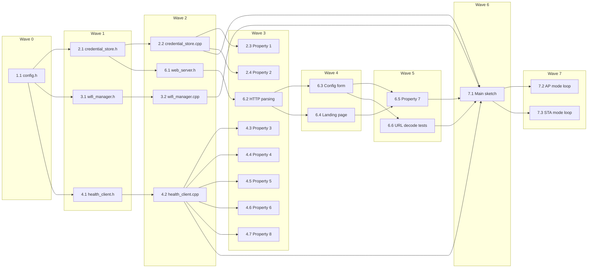

# Implementation Plan: WiFi Configuration App

## Overview

Implement a WiFi configuration application for the Adafruit Feather M0 (SAMD21) that operates in two modes: AP mode (serving a credential entry form) and STA mode (connecting to WiFi and serving a health landing page). The implementation uses Arduino with WiFi101, FlashStorage, and ArduinoJson libraries, structured as separate modules for credential storage, WiFi management, web serving, and health checking.

## Tasks

- [ ] 1. Set up project structure and configuration constants
  - [ ] 1.1 Create config.h with all application constants
    - Define AP_SSID, WEB_SERVER_PORT, WIFI_CONNECT_TIMEOUT_MS
    - Define HEALTH_HOST, HEALTH_PATH, HEALTH_PORT, HEALTH_MAX_RETRIES, HEALTH_RETRY_DELAY_MS
    - Define MAX_SSID_LENGTH, MAX_PASS_LENGTH
    - _Requirements: 1.1, 1.3, 1.4, 3.2, 7.1, 7.2_

- [ ] 2. Implement credential storage module
  - [ ] 2.1 Create credential_store.h with WiFiCredentials struct and function declarations
    - Define WiFiCredentials struct with valid flag, ssid, and password fields
    - Declare credentialStore_init(), credentialStore_hasCredentials(), credentialStore_read(), credentialStore_write(), credentialStore_clear()
    - _Requirements: 5.1, 5.3_

  - [ ] 2.2 Implement credential_store.cpp using FlashStorage library
    - Use FlashStorage to allocate a flash page for the WiFiCredentials struct
    - Implement init to read current state from flash
    - Implement hasCredentials to check the valid flag
    - Implement read to copy stored credentials into the output struct
    - Implement write to set valid=true, copy SSID and password, and commit to flash
    - Implement clear to set valid=false and commit to flash
    - _Requirements: 1.1, 1.2, 5.1, 5.3, 6.2_

  - [ ] 2.3 Write property test for credential round-trip (Property 1)
    - **Property 1: Credential persistence round-trip**
    - For any valid SSID (1–32 chars) and password (0–64 chars), writing then reading produces the exact same values with valid=true
    - **Validates: Requirements 5.1, 5.3**

  - [ ] 2.4 Write property test for failed credentials not persisted (Property 2)
    - **Property 2: Failed credentials are never persisted**
    - For any SSID/password pair where connection fails, credential store must not be modified
    - **Validates: Requirements 4.4**

- [ ] 3. Implement WiFi manager module
  - [ ] 3.1 Create wifi_manager.h with function declarations
    - Declare wifiManager_startAP(), wifiManager_stopAP(), wifiManager_connect(), wifiManager_disconnect(), wifiManager_getIP(), wifiManager_isConnected()
    - _Requirements: 1.1, 1.3, 3.1, 3.3_

  - [ ] 3.2 Implement wifi_manager.cpp using WiFi101 library
    - Implement startAP using WiFi.beginAP(AP_SSID) for open AP with SSID "tempmon"
    - Implement connect using WiFi.begin(ssid, pass) with polling loop up to WIFI_CONNECT_TIMEOUT_MS
    - Implement stopAP to disable the access point after successful connection
    - Implement disconnect to drop the current WiFi connection
    - Implement getIP to return WiFi.localIP()
    - Implement isConnected to check WiFi.status() == WL_CONNECTED
    - _Requirements: 1.1, 1.2, 1.3, 3.1, 3.2, 3.3, 3.4, 4.1, 4.2_

- [ ] 4. Implement health client module
  - [ ] 4.1 Create health_client.h with HealthResult struct and function declarations
    - Define HealthResult struct with success, status, version, and missingFields fields
    - Declare healthClient_fetch() and healthClient_getCached()
    - _Requirements: 7.1, 7.4, 7.5_

  - [ ] 4.2 Implement health_client.cpp with HTTP GET and JSON parsing
    - Implement fetch using WiFiClient to connect to HEALTH_HOST:HEALTH_PORT and send GET request to HEALTH_PATH
    - Implement retry logic: up to 3 retries with 5-second delay between attempts
    - Parse JSON response using ArduinoJson StaticJsonDocument
    - Extract "status" and "version" fields; set missingFields flag if either is absent
    - Cache successful results in module-level static variables
    - Implement getCached to return last successful status and version
    - _Requirements: 7.1, 7.2, 7.3, 7.4, 7.5, 9.1, 9.2, 9.3, 9.4_

  - [ ] 4.3 Write property test for JSON parsing correctness (Property 3)
    - **Property 3: JSON health response parsing extracts fields correctly**
    - For any valid JSON with "status" and "version" string fields, parser extracts both unchanged
    - **Validates: Requirements 7.4, 9.1, 9.2**

  - [ ] 4.4 Write property test for invalid JSON handling (Property 4)
    - **Property 4: Invalid JSON produces parse failure**
    - For any non-JSON string, parser returns failure with empty fields and no partial extraction
    - **Validates: Requirements 9.3**

  - [ ] 4.5 Write property test for missing fields detection (Property 5)
    - **Property 5: Valid JSON with missing fields signals incomplete data**
    - For any valid JSON missing "status" or "version", parser returns success with missingFields=true
    - **Validates: Requirements 9.4**

  - [ ] 4.6 Write property test for health cache behavior (Property 6)
    - **Property 6: Health cache reflects last successful parse**
    - After any sequence of fetches where at least one succeeds, cached values equal the most recent success
    - **Validates: Requirements 7.5**

  - [ ] 4.7 Write property test for retry logic bounds (Property 8)
    - **Property 8: Retry logic respects maximum attempts**
    - For any sequence of failures, at most 4 total requests are made (1 initial + 3 retries)
    - **Validates: Requirements 7.2**

- [ ] 5. Checkpoint - Ensure all tests pass
  - Ensure all tests pass, ask the user if questions arise.

- [ ] 6. Implement web server module
  - [ ] 6.1 Create web_server.h with mode enum and function declarations
    - Define WebServerMode enum (MODE_CONFIG_FORM, MODE_LANDING_PAGE)
    - Declare webServer_init(), webServer_poll(), webServer_setMode(), webServer_setError(), webServer_setHealthData()
    - _Requirements: 1.4, 2.1, 8.1_

  - [ ] 6.2 Implement HTTP request parsing in web_server.cpp
    - Parse incoming HTTP requests to extract method (GET/POST), path, and body
    - Implement URL-decoding for form-urlencoded POST body parameters
    - Extract ssid and password fields from form submission
    - _Requirements: 2.1, 3.1_

  - [ ] 6.3 Implement config form HTML generation and serving
    - Generate HTML page with text input for SSID, password input for password, and submit button
    - Include error message display area (populated when webServer_setError is called)
    - Serve config form on GET / when in MODE_CONFIG_FORM
    - Handle POST /submit to extract credentials and signal main sketch
    - Return HTTP 500 with plain-text error message on technical failures
    - _Requirements: 2.1, 2.2, 2.3, 2.4, 2.5, 4.3_

  - [ ] 6.4 Implement landing page HTML generation and serving
    - Generate HTML page displaying health status and version
    - Show cached data with error message when latest health check fails but cache exists
    - Show error-only message when health check fails and no cache exists
    - Serve landing page on GET / when in MODE_LANDING_PAGE
    - _Requirements: 8.1, 8.2, 8.3, 8.4, 8.5_

  - [ ] 6.5 Write property test for landing page HTML content (Property 7)
    - **Property 7: Landing page HTML contains health data**
    - For any non-empty status and version strings, generated HTML contains both verbatim
    - **Validates: Requirements 8.2**

  - [ ] 6.6 Write unit tests for URL decoding
    - Test standard URL-encoded characters (%20, %2F, +, etc.)
    - Test edge cases: empty string, already-decoded string, malformed percent sequences
    - _Requirements: 3.1_

- [ ] 7. Implement main sketch with state machine
  - [ ] 7.1 Create wifi-config-app.ino with setup() and loop()
    - In setup(): initialize Serial, credential store, and determine boot mode
    - If no credentials: start AP, init web server in config form mode
    - If credentials exist: attempt connection; on success enter STA mode, on failure clear credentials and enter AP mode
    - _Requirements: 1.1, 1.2, 6.1, 6.2_

  - [ ] 7.2 Implement AP mode loop logic
    - Poll web server for incoming requests
    - On form submission: attempt WiFi connection with submitted credentials
    - On connection success: write credentials to store, stop AP, fetch health, switch to landing page mode
    - On credential store write failure: show error, disconnect WiFi, remain in AP mode
    - On connection failure/timeout: set error message, remain in AP mode serving config form
    - _Requirements: 3.1, 3.2, 3.3, 3.4, 4.1, 4.2, 4.3, 4.4, 5.1, 5.2_

  - [ ] 7.3 Implement STA mode loop logic
    - Poll web server for incoming requests
    - On each request to landing page: fetch health endpoint, update landing page data, serve response
    - Handle health fetch results: update cache on success, use cached data on failure
    - _Requirements: 7.3, 7.5, 8.1, 8.2, 8.3, 8.4_

- [ ] 8. Final checkpoint - Ensure all tests pass
  - Ensure all tests pass, ask the user if questions arise.

## Notes

- Tasks marked with `*` are optional and can be skipped for faster MVP
- Each task references specific requirements for traceability
- Checkpoints ensure incremental validation
- Property tests validate universal correctness properties from the design document
- Unit tests validate specific examples and edge cases
- Property tests require extracting pure logic (JSON parsing, URL decoding, HTML generation) into testable functions that can run on a host machine using RapidCheck + Catch2
- Integration testing of WiFi radio behavior, flash persistence across power cycles, and real HTTP requests requires manual testing on hardware

## Task Dependency Graph

<details>
<summary>Wave definitions (JSON)</summary>

```json
{
  "waves": [
    { "id": 0, "tasks": ["1.1"] },
    { "id": 1, "tasks": ["2.1", "3.1", "4.1"] },
    { "id": 2, "tasks": ["2.2", "3.2", "4.2", "6.1"] },
    { "id": 3, "tasks": ["2.3", "2.4", "4.3", "4.4", "4.5", "4.6", "4.7", "6.2"] },
    { "id": 4, "tasks": ["6.3", "6.4"] },
    { "id": 5, "tasks": ["6.5", "6.6"] },
    { "id": 6, "tasks": ["7.1"] },
    { "id": 7, "tasks": ["7.2", "7.3"] }
  ]
}
```

</details>


